# Blackjack 遊戲流程設計文件

> 本文件依據遊戲流程圖整理，描述單局 Blackjack（含 Bet Behind 旁注、Side Bets 邊注、Insurance 保險、Split 分牌）的完整流程。
> 流程共分為 7 個階段：Table（桌台）→ Betting（投注）→ Initial Deal（初始發牌）→ Insurance（保險）→ Player Action（玩家動作）→ Dealer（荷官）→ Settlement & Next（結算與下一局）。

---

## 一、總覽流程圖

```mermaid
flowchart TD
    %% ===== Table =====
    subgraph TABLE["🪑 Table 桌台"]
        Join{Join as?}
        Join -->|Seat Player| SeatMain[Can place Main Bet and Bet Behind]
        Join -->|Spectator| SpecBehind[Can only Bet Behind]
    end

    %% ===== Betting =====
    subgraph BET["🎰 Betting 投注"]
        Wait[Wait Next Round]
        AnyMain{Any seat player<br/>placed Main Bet?}
        Wait --> AnyMain
        AnyMain -->|No| Wait
        AnyMain -->|Yes| BetPhase[Betting Phase]
        BetPhase --> PlaceMain[Seat Player: Place Main Bet]
        PlaceMain --> Optional[Optional: Side Bets / Bet Behind]
        Optional --> LockBets[Betting End / Lock Bets]
    end

    SeatMain --> Wait
    SpecBehind --> Wait

    %% ===== Initial Deal =====
    subgraph DEAL["🃏 Initial Deal 初始發牌"]
        InitDeal[Initial Deal]
        DealSeq["Each seat player gets 1st card<br/>→ Dealer 1 up card<br/>→ Seat player 2nd card<br/>→ Dealer 1 hole card"]
        BJCheck[Blackjack Check]
        ResolveSide[Resolve Side Bets]
        InitDeal --> DealSeq --> BJCheck --> ResolveSide
    end

    LockBets --> InitDeal

    %% ===== Insurance =====
    subgraph INS["🛡️ Insurance 保險"]
        UpAce{Dealer up card = Ace?}
        InsPhase[Insurance Phase]
        BuyIns{Buy Insurance?}
        DlrBJ1{Dealer Blackjack?}
        DlrBJ2{Dealer Blackjack?}
        RevealHole1[Reveal Hole Card]
        RevealHole2[Reveal Hole Card]
        PlayerBJ{Player Blackjack?}
        InsLose[Insurance Lose]
        NoInsPay[No Insurance Payout]
        InsPush[Insurance Push]
        InsWin[Insurance Win]
        ResolveMain[Resolve Main Bet]
        ResolveBehind[Resolve Bet Behind]
        Settle[Settle]
        NeedAction{Any seated player<br/>needs action?}

        UpAce -->|Yes| InsPhase
        UpAce -->|No| NeedAction
        InsPhase --> BuyIns
        BuyIns -->|Yes| DlrBJ1
        BuyIns -->|No| DlrBJ2
        DlrBJ1 -->|Yes| RevealHole1
        DlrBJ1 -->|No| NeedAction
        RevealHole1 --> PlayerBJ
        PlayerBJ -->|Yes| InsPush
        PlayerBJ -->|No| InsWin
        InsPush --> ResolveMain
        InsWin --> ResolveMain
        ResolveMain --> ResolveBehind --> Settle
        DlrBJ2 -->|Yes| InsLose
        DlrBJ2 -->|No| NeedAction
        InsLose --> RevealHole2
        RevealHole2 --> NoInsPay
        NoInsPay --> ResolveMain
    end

    ResolveSide --> UpAce

    %% ===== Player Action =====
    subgraph PLAY["🎮 Player Action 玩家動作"]
        PlayPhase[Player Action Phase]
        SeatOrder[Seat 1 → Seat 7 in order]
        ActionQ{Action?}
        StandA[Stand]
        Total11{Total ≤ 11?}
        AutoHit[Auto Hit]
        DrawP[Draw card]
        BustQ{Bust?}
        BustP[Bust]
        AutoStand[Auto Stand]
        DoubleA[Double + 1 card]
        SplitA[Split into 2 hands]
        NextP[Next player]

        PlayPhase --> SeatOrder --> ActionQ
        ActionQ -->|Stand| StandA
        ActionQ -->|Hit| Total11
        ActionQ -->|Timeout| Total11
        ActionQ -->|Double| DoubleA
        ActionQ -->|Split| SplitA
        Total11 -->|Yes| AutoHit
        Total11 -->|No| DrawP
        AutoHit --> DrawP
        DrawP --> BustQ
        BustQ -->|Yes| BustP
        BustQ -->|No| AutoStand
        StandA --> NextP
        DoubleA --> NextP
        SplitA --> NextP
        BustP --> NextP
        AutoStand --> NextP
    end

    NeedAction -->|Yes| PlayPhase
    NeedAction -->|No| DealerPhase

    %% ===== Dealer =====
    subgraph DLR["🎩 Dealer 荷官"]
        DealerPhase[Dealer Phase]
        DrawD[Draw card]
        RevealD[Reveal hole card]
        Dlr17{Dealer < 17?}
        SettlePhase[Settlement]

        DealerPhase --> RevealD --> Dlr17
        Dlr17 -->|Yes| DrawD
        DrawD --> Dlr17
        Dlr17 -->|No| SettlePhase
    end

    NextP --> DealerPhase
    Settle --> DealerPhase

    %% ===== Settlement & Next =====
    subgraph SET["💰 Settlement & Next 結算"]
        Compare[Compare result]
        SetMain[Resolve Main Bet]
        SetBehind[Resolve Bet Behind]
        UpdateBal[Update balance / history]
        NextRound([Next Round])

        Compare --> SetMain --> SetBehind --> UpdateBal --> NextRound
    end

    SettlePhase --> Compare
    NextRound --> Wait
```

---

## 二、階段說明

### 1. Table 桌台

玩家進入牌桌時選擇身分：

- **Seat Player（入座玩家）**：可下 **Main Bet（主注）** 並可下 **Bet Behind（旁注）**。
- **Spectator（旁觀者）**：僅能下 **Bet Behind（旁注）**，不參與主注決策。

兩種身分皆進入下一局等待（Wait Next Round）。

### 2. Betting 投注

進入投注前先 **Wait Next Round**，並判斷 **是否有任一入座玩家下了主注**：

- 否 → 回到 Wait Next Round 繼續等待。
- 是 → 進入 **Betting Phase**。

投注順序：入座玩家下主注（Place Main Bet）→ 可選下邊注 / 旁注（Side Bets / Bet Behind）→ **Betting End / Lock Bets（封盤鎖注）**。封盤後不可再變更注碼。

### 3. Initial Deal 初始發牌

發牌固定順序：**每位入座玩家發第 1 張 → 荷官 1 張明牌（up card）→ 入座玩家發第 2 張 → 荷官 1 張暗牌（hole card）**。

接著進行 **Blackjack Check（天牌檢查）** 與 **Resolve Side Bets（結算邊注）**。邊注於此階段獨立先行結算，不受後續主注流程影響。

### 4. Insurance 保險

判斷 **荷官明牌是否為 Ace**：

- **否** → 直接進入「是否有玩家需要動作？」判斷。
- **是** → 進入 **Insurance Phase**，詢問玩家 **是否購買保險**。

**購買保險（Yes）分支**：判斷荷官是否 Blackjack。

- 荷官 BJ → 翻開暗牌（Reveal Hole Card）→ 判斷玩家是否 Blackjack：
  - 玩家 BJ → **Insurance Push（保險與主注互抵 / 退注）**
  - 玩家非 BJ → **Insurance Win（保險中獎，賠 2:1）**
  - 兩者皆續行 Resolve Main Bet → Resolve Bet Behind → **Settle**。
- 荷官非 BJ → 進入「是否有玩家需要動作？」判斷（保險注於此情況輸掉，遊戲繼續）。

**不購買保險（No）分支**：判斷荷官是否 Blackjack。

- 荷官 BJ → **Insurance Lose** → 翻開暗牌 → **No Insurance Payout（無保險賠付）** → Resolve Main Bet 結算。
- 荷官非 BJ → 進入「是否有玩家需要動作？」判斷。

**是否有玩家需要動作？**

- 是 → 進入 Player Action Phase。
- 否 → 直接進入 Dealer Phase（例如荷官已 BJ 提前結算，或全部玩家已結束）。

### 5. Player Action 玩家動作

進入 **Player Action Phase**，依 **Seat 1 → Seat 7** 順序逐位處理。每位玩家判斷 **Action？**：

| 動作 | 流程 |
|---|---|
| **Stand** | 停牌 → Next player |
| **Hit / Timeout** | 判斷 Total ≤ 11？是 → Auto Hit → Draw card；否 → 直接 Draw card |
| **Double** | Double + 1 card（加倍補一張）→ Next player |
| **Split** | Split into 2 hands（分為兩手）→ Next player |

**補牌後判斷 Bust？**

- 爆牌（Yes）→ **Bust** → Next player。
- 未爆（No）→ **Auto Stand** → Next player。

> 說明：`Total ≤ 11` 時補牌不可能爆牌，故系統 **Auto Hit**；Timeout（超時）視同 Hit 處理以保護流程進行。所有玩家處理完成後進入 Dealer Phase。

### 6. Dealer 荷官

進入 **Dealer Phase**：翻開暗牌（Reveal hole card）→ 判斷 **Dealer < 17？**

- 是 → Draw card（補牌）→ 重新判斷（迴圈）。
- 否 → 進入 **Settlement**。

> 即荷官補牌至 17 點（含）以上才停手。是否於 Soft 17 補牌（H17/S17）依桌規設定。

### 7. Settlement & Next 結算與下一局

依序執行：**Compare result（比牌）→ Resolve Main Bet（結算主注）→ Resolve Bet Behind（結算旁注）→ Update balance / history（更新餘額與紀錄）→ Next Round（進入下一局）**。

下一局回到 Betting 的 Wait Next Round，循環開始。

---

## 三、關鍵判斷節點彙整

| 判斷節點 | 條件 | Yes 走向 | No 走向 |
|---|---|---|---|
| Join as? | 身分選擇 | Seat Player（主注+旁注） | Spectator（僅旁注） |
| Any seat player placed Main Bet? | 是否有人下主注 | Betting Phase | 回到 Wait Next Round |
| Dealer up card = Ace? | 荷官明牌為 A | Insurance Phase | 是否有玩家需動作 |
| Buy Insurance? | 玩家是否買保險 | 檢查荷官 BJ（買保險路徑） | 檢查荷官 BJ（不買路徑） |
| Dealer Blackjack? | 荷官是否天牌 | 翻牌 / Insurance Lose | 是否有玩家需動作 |
| Player Blackjack? | 玩家是否天牌 | Insurance Push | Insurance Win |
| Any seated player needs action? | 是否需玩家動作 | Player Action Phase | Dealer Phase |
| Total ≤ 11? | 點數是否≤11 | Auto Hit | Draw card |
| Bust? | 補牌是否爆牌 | Bust | Auto Stand |
| Dealer < 17? | 荷官點數<17 | Draw card（補牌） | Settlement |

---

*版本：依流程圖 v1.2 整理 | 涵蓋：桌台身分、投注、發牌、保險、玩家決策、荷官補牌、結算循環*
